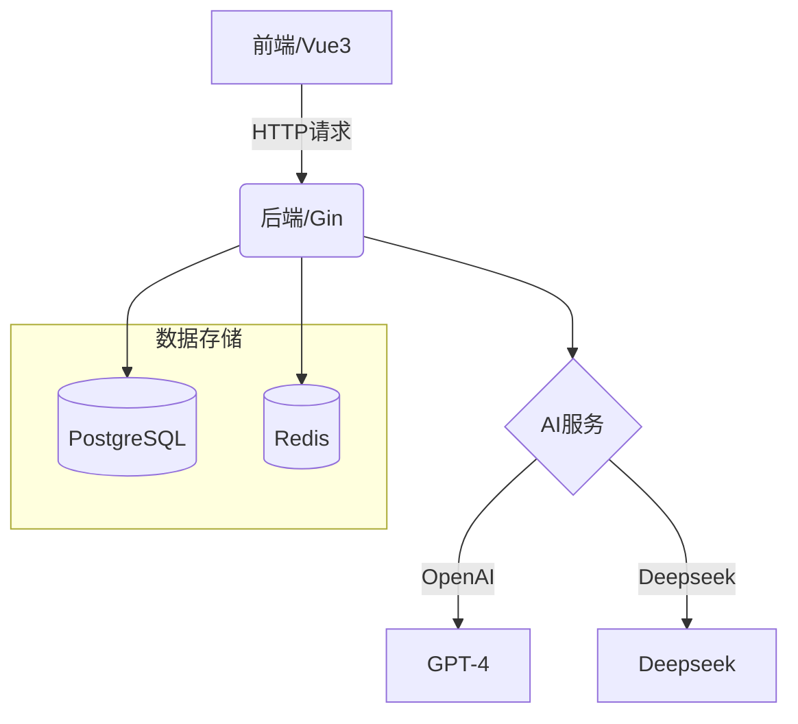
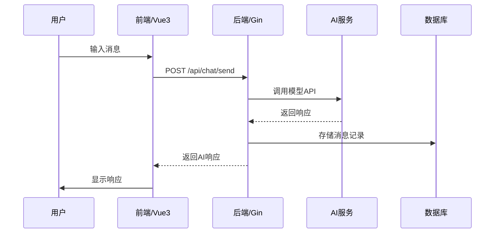

# Web Chat Service

一个类似 OpenAI/Deepseek 的 Web 聊天服务系统。

## 功能特点

- 用户认证和会话管理
- 多模型支持（OpenAI、Deepseek等）
- Agent系统支持
- 用户数据隔离

## 项目结构

```
├── frontend/           # 前端Vue项目
├── backend/            # 后端Go项目
│   ├── api/           # API接口
│   ├── auth/          # 认证相关
│   ├── models/        # 数据模型
│   ├── services/      # 业务逻辑
│   └── utils/         # 工具函数
├── configs/           # 配置文件
└── docs/              # 文档
```

## 系统架构图



## 核心数据流图



## 技术栈

### 前端
- Vue 3
- TypeScript
- Tailwind CSS

### 后端
- Go
- PostgreSQL
- Redis

## 开发环境设置

### 方式一：一键启动（推荐）

项目提供了一键启动脚本，自动完成数据库、后端和前端的启动流程：

```bash
# 添加执行权限
chmod +x start.sh

# 运行启动脚本
./start.sh
```

脚本会自动：
1. 启动Docker中的PostgreSQL和Redis服务
2. 等待数据库就绪
3. 启动后端Go服务
4. 启动前端开发服务器
5. 提供访问地址

按Ctrl+C可一键停止所有服务。

### 方式二：手动启动

#### 后端启动
```bash
# 进入后端目录
cd backend/

# 安装依赖
go mod tidy
go mod download

# 启动服务（默认端口8080）
go run main.go
```

#### 前端启动
```bash
# 进入前端目录
cd frontend/

# 安装依赖
npm install

# 启动开发服务器（默认端口5173）
npm run dev
```

### 数据库配置

#### 方式一：本地安装
1. 安装PostgreSQL
```bash
brew install postgresql
brew services start postgresql
```
2. 安装Redis
```bash
brew install redis
brew services start redis
```
3. 创建数据库
```sql
CREATE DATABASE webchat;
```

#### 方式二：Docker部署（推荐）
1. 确保已安装Docker和Docker Compose
2. 检查Docker环境（如遇到Docker守护进程未运行等问题）
```bash
# 添加执行权限
chmod +x docker-check.sh

# 运行检查脚本
./docker-check.sh
```

3. 使用项目根目录的docker-compose.yml启动服务
```bash
# 启动服务
docker-compose up -d

# 查看服务状态
docker-compose ps

# 停止服务
docker-compose down
```

常见问题：
- 如果遇到 `Cannot connect to the Docker daemon` 错误，请确保Docker守护进程已启动：
  - macOS: 启动Docker Desktop或OrbStack应用
  - Linux: 运行 `sudo systemctl start docker`
  - Windows: 启动Docker Desktop应用

服务端口映射：
- PostgreSQL: localhost:5432 (用户名:postgres, 密码:postgres, 数据库:webchat)
- Redis: localhost:6379

### 环境变量配置
在项目根目录创建.env文件：
```env
# 服务器配置
SERVER_PORT=8080

# 数据库配置
DB_HOST=localhost
DB_PORT=5432
DB_USER=postgres
DB_PASSWORD=postgres
DB_NAME=webchat

# Redis配置
REDIS_HOST=localhost
REDIS_PORT=6379
REDIS_PASSWORD=

# JWT配置
JWT_SECRET=your-secret-key

# AI API配置（系统默认使用Deepseek API）
DEEPSEEK_API_KEY=your-deepseek-api-key
OPENAI_API_KEY=your-openai-api-key
```

> **注意**：系统默认使用Deepseek API，如果未指定模型，将自动选择Deepseek。确保至少配置了`DEEPSEEK_API_KEY`环境变量。

## 许可证

MIT